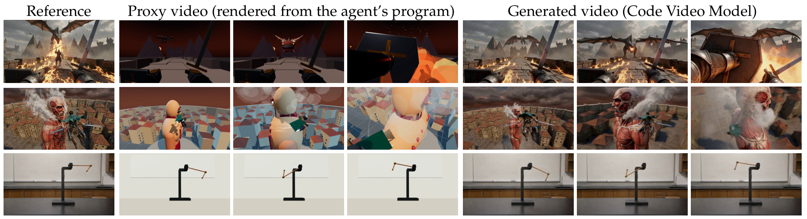
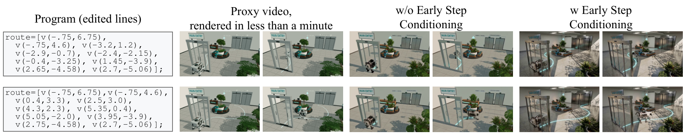
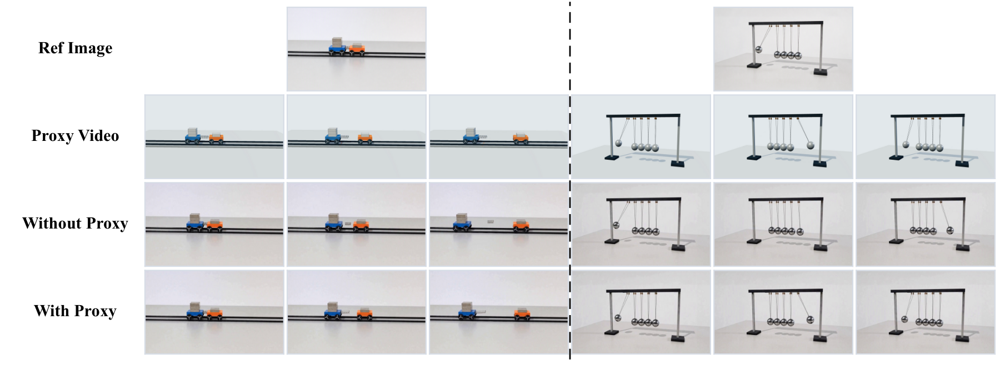
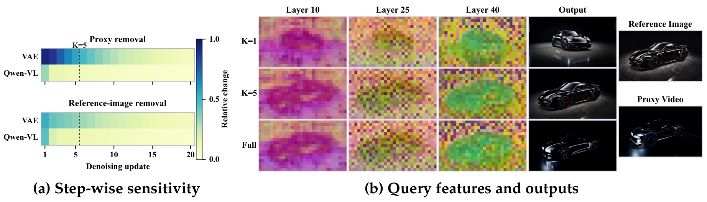
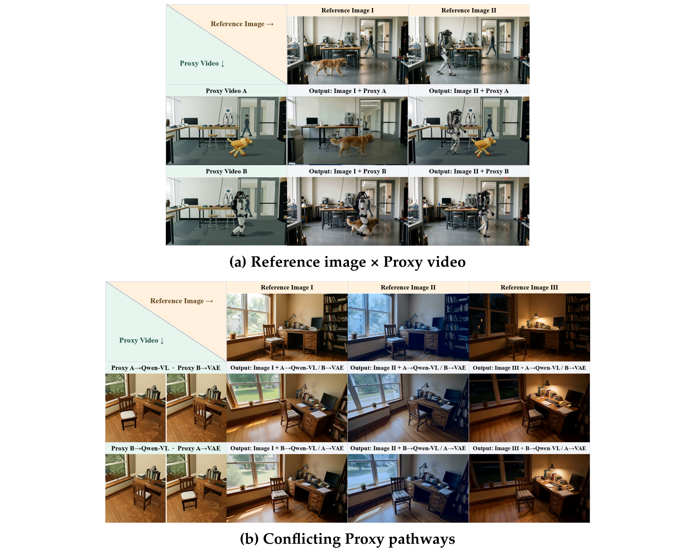
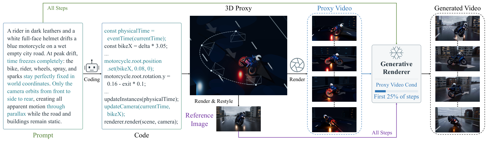

# Code Video Model：以可执行场景表示驱动可控视频生成

视频生成模型的视觉质量不断提升，但场景布局、运动轨迹和相机时序仍主要由模型隐式决定。如何明确表达这些约束，并在生成前检查和修改，是实现可控视频生成的重要问题。

**Code Video Model** 用可执行程序描述场景与镜头，将结构设计与视觉合成分开处理。Coding Agent 将 Prompt 转化为代码，渲染出可编辑的场景预演，再由预训练视频模型结合预演与外观参考生成画面。研究通过系统实验分析视觉条件在去噪过程中的作用，据此提出免训练的阶段化条件调度，在保留程序结构约束的同时，减少预演外观对最终画面的干扰。

<video controls playsinline preload="none" poster="static/promotional-article/assets/demo-poster.jpg" src="static/demo/Demo_CodeVideoModel_New.mp4?v=f3259741b723aa48" aria-label="Code Video Model 完整演示视频">
</video>

## 01 可执行场景表示：统一描述、预演与编辑

**Code Video Model** 借鉴影视预演，由 Coding Agent 根据提示词编写 Three.js 程序，统一定义几何布局、物体运动、相机轨迹和事件时序。程序渲染出的预演视频（proxy video）提供时空约束，参考图指定目标外观。生成模型在此基础上补充几何细节、材质与光照，无需将预演本身制作成精细的三维动画。

*Figure 1｜外观参考、程序预演与生成结果的对应关系。*

代码既描述场景，也提供直接的编辑接口。空间和时间要求被表示为坐标、轨迹与事件逻辑，修改可以精确定位到相应对象和参数。Coding Agent 通过“编程—渲染—检查—修订”迭代场景。程序确定后，预演渲染不到一分钟，便于在运行视频模型前检查构图、运动和时序。

Figure 2 中，修改路径点即可重新规划四足机器人的路线，同时保留其余场景设定。更新后的预演再引导视频生成相应的轨迹变化。

*Figure 2｜程序化轨迹编辑，以及有无早期条件调度的生成对照。*

同一表示还支持物体增删、尺度调整、场景替换和动作时序编辑。独立控制物体运动与相机的时间进程，可以实现动作冻结、相机继续环绕的“子弹时间”镜头。对于具有数学描述的物理过程，程序可通过方程计算运动。双摆、弹簧回弹和牛顿摆等案例，以计算得到的动态预演为视频生成提供物理引导。

*Figure 3｜弹簧回弹与牛顿摆：程序化物理预演及其生成引导效果。*

这种精确性首先体现在程序与预演中。最终视频尚不能保证逐像素对应，但场景约束已可直接定义、修改和验证，不再完全依赖模型对文字的推断。

## 02 从条件机制研究到免训练生成范式

程序预演能为参考驱动的视频模型（R2V）提供结构约束，但其简化的几何与材质也可能被模型保留，影响目标外观。为厘清二者的关系，研究在保持 MiniMax-H3 参数冻结的条件下，系统考察条件组成、介入阶段、持续时长及原生通路，并结合内部特征分析，追踪结构与外观信息如何影响生成。

时间条件分析（Temporal Conditioning）发现，预演在早期介入不足时，结构跟随较弱。持续施加预演虽能加强结构约束，却会使结果保留更多合成外观。保持条件时长不变、仅将其移至后期，也难以获得同等的结构控制效果。加噪实验则表明，削弱预演外观的同时可能损伤几何与运动信息。

通路实验显示，Qwen-VL 编码器对外观的影响更强，VAE 通路对运动与结构的影响更强，移除任一通路都会降低综合表现。研究还在固定去噪状态下逐一移除条件组，以预测结果的归一化变化衡量敏感性。预演经 VAE 通路产生的影响在早期最强，随后逐渐减弱，经编码器通路产生的响应则在首次更新后迅速下降。

*Figure 4｜条件敏感性分析，以及不同调度下的 Query 特征与生成结果对照。*

注意力模块中的 Query 特征提供了进一步证据。研究比较不同条件调度下的内部表征，发现预演撤去后，早期引导造成的特征差异仍然存在。对应输出也显示，短时介入的结构跟随不足，而全程介入更容易保留合成外观。这些观察说明，早期引导的影响能够延续到后续生成。

为分析多路条件的交互，研究交叉组合金毛犬与人形机器人的参考图和预演，并交换两条通路的预演输入，配合蓝色重绘与夜景参考，观察条件冲突下的生成结果。夜景参考能够改变画面亮度，但蓝色重绘未被稳定保留。当主体拓扑不一致时，预演中的几何也会干扰参考图中的主体特征。这表明结构与外观条件并非独立生效，模型先验也会影响最终结果。

*Figure 5｜主体交叉组合、通路交换与外观干预下的视觉条件交互。*

这些实验表明，早期预演引导有利于建立结构，其影响能够持续保留，而长期施加预演会增加外观干扰。两条原生通路的互补作用也应保留。基于这些实验洞察，**Code Video Model** 提出 Training-Free 的阶段化条件调度。方法在去噪早期通过原生双通路引入预演的时空约束，随后撤去预演，让模型在文本与参考图的持续引导下细化外观。

*Figure 6｜阶段化条件调度：早期引入预演约束，后期由文本与参考图引导外观细化。*

该方法调整条件的作用时段，不改变预演内容或模型原生接口，也无需更新参数或训练额外控制模块，从而兼顾结构跟随与目标外观。

## 03 跨场景应用：从程序约束到多样化视觉生成

可执行表示为不同任务提供了统一的控制接口。程序定义场景与动态过程，参考图指定视觉风格，同一方法因而可以用于不同类型的镜头。我们的算法支持丰富的业务场景，包括 Anime、Bullet Time、Gaming、Scene Editing、Robotics & Trajectory Control、Architectural Cinematics、Product Cinematography、Physical Grounding 和 3D / 4D Reconstruction。每组左侧为 Three.js 预演，右侧为生成视频，可同步播放并拖动分界线进行对照。

<figure class="application-card">
<h3>Anime</h3>

<figure><video controls muted playsinline preload="none" poster="static/promotional-article/assets/application-anime-threejs.jpg" src="static/project-page-cases/anime/anime-hotel/threejs-b0afbeca4b711b53.mp4?v=b0afbeca4b711b53" aria-label="动画 Three.js 预演"></video></figure>
<figure><video controls muted playsinline preload="none" poster="static/promotional-article/assets/application-anime.jpg" src="static/project-page-cases/anime/anime-hotel/Anime_01.mp4?v=a21781b4e0aed258" aria-label="动画应用：酒店大厅角色动作"></video></figure>

Three.jsCode Video Model

</figure>
<figure class="application-card">
<h3>Bullet Time</h3>

<figure><video controls muted playsinline preload="none" poster="static/promotional-article/assets/application-bullet-time-threejs.jpg" src="static/project-page-cases/experiment-inputs/2e39cbc22a4325da26c3ce79bfa6939aafb839776d288c49802c7a5064ca76e3/threejs.mp4?v=2e39cbc22a4325da" aria-label="子弹时间 Three.js 预演"></video></figure>
<figure><video controls muted playsinline preload="none" poster="static/promotional-article/assets/application-bullet-time.jpg" src="static/project-page-cases/selected-0907-seedvr2-2x/bullet-time/Bullet_Time_02.mp4?v=d0a8579dcd22aab2" aria-label="子弹时间应用：摩托车镜头"></video></figure>

Three.jsCode Video Model

</figure>
<figure class="application-card">
<h3>Gaming</h3>

<figure><video controls muted playsinline preload="none" poster="static/promotional-article/assets/application-gaming-threejs.jpg" src="static/project-page-cases/threejs/first-person-games/Gaming_04.mp4?v=1c03ca919eefbf43" aria-label="第一人称游戏 Three.js 预演"></video></figure>
<figure><video controls muted playsinline preload="none" poster="static/promotional-article/assets/application-gaming.jpg" src="static/project-page-cases/code-video-model/first-person-games/Gaming_04.mp4?v=0c5f036db8d244d7" aria-label="游戏应用：第一人称森林行进"></video></figure>

Three.jsCode Video Model

</figure>
<figure class="application-card">
<h3>Scene Editing</h3>

<button type="button" class="pair-edit-toggle" data-edit-label="Move Chair to Desk" aria-pressed="false">Move Chair to Desk</button>

<figure><video controls muted playsinline preload="none" poster="static/promotional-article/assets/application-scene-editing-threejs.jpg" src="static/project-page-cases/experiment-inputs/6d4990f6cba4131a62288fa72657478665377779fa92b3684e060f3f0224f2d3/threejs.mp4?v=6d4990f6cba4131a" data-src-a="static/project-page-cases/experiment-inputs/6d4990f6cba4131a62288fa72657478665377779fa92b3684e060f3f0224f2d3/threejs.mp4?v=6d4990f6cba4131a" data-src-b="static/project-page-cases/experiment-inputs/623298afee7cc13e32a2d5cc0a9ef7613b329223835bec05ba3859a788e09733/threejs.mp4?v=623298afee7cc13e" data-poster-a="static/promotional-article/assets/application-scene-editing-threejs.jpg" data-poster-b="static/promotional-article/assets/application-scene-editing-after-threejs.jpg" aria-label="场景与环境编辑 Three.js 预演"></video></figure>
<figure><video controls muted playsinline preload="none" poster="static/promotional-article/assets/application-scene-editing.jpg" src="static/project-page-cases/experiment-group23-image-group23-4-v12/scene-world-editing/Scene_World_Editing_01_A.mp4?v=db0376ec4673e633" data-src-a="static/project-page-cases/experiment-group23-image-group23-4-v12/scene-world-editing/Scene_World_Editing_01_A.mp4?v=db0376ec4673e633" data-src-b="static/project-page-cases/experiment-group23-image-group23-4-v12/scene-world-editing/Scene_World_Editing_01_B.mp4?v=61895e9bf6889510" data-poster-a="static/promotional-article/assets/application-scene-editing.jpg" data-poster-b="static/promotional-article/assets/application-scene-editing-after-generated.jpg" aria-label="场景与环境编辑应用"></video></figure>

Three.jsCode Video Model

</figure>
<figure class="application-card">
<h3>Robotics & Trajectory Control</h3>

<button type="button" class="pair-edit-toggle" data-edit-label="Use Quadruped Robot" aria-pressed="false">Use Quadruped Robot</button>

<figure><video controls muted playsinline preload="none" poster="static/promotional-article/assets/application-robotics-threejs.jpg" src="static/project-page-cases/experiment-inputs/a1d128ed64f19e89a83f7c788ac3abc26b6b78f9951f4984d63d19854695d834/threejs.mp4?v=a1d128ed64f19e89" data-src-a="static/project-page-cases/experiment-inputs/a1d128ed64f19e89a83f7c788ac3abc26b6b78f9951f4984d63d19854695d834/threejs.mp4?v=a1d128ed64f19e89" data-src-b="static/project-page-cases/experiment-inputs/254888291a343e47b34f855af274a89850641ef2aeb01e65f742e73f9fbedf3a/threejs.mp4?v=254888291a343e47" data-poster-a="static/promotional-article/assets/application-robotics-threejs.jpg" data-poster-b="static/promotional-article/assets/application-robotics-after-threejs.jpg" aria-label="机器人与轨迹控制 Three.js 预演"></video></figure>
<figure><video controls muted playsinline preload="none" poster="static/promotional-article/assets/application-robotics.jpg" src="static/project-page-cases/experiment-pairs/Robotics_Trajectory_Control_03/Robotics_Trajectory_Control_03_A.mp4?v=2bdfbe4b1b132f43" data-src-a="static/project-page-cases/experiment-pairs/Robotics_Trajectory_Control_03/Robotics_Trajectory_Control_03_A.mp4?v=2bdfbe4b1b132f43" data-src-b="static/project-page-cases/experiment-pairs/Robotics_Trajectory_Control_03/Robotics_Trajectory_Control_03_B.mp4?v=b8a23ca6efc40aba" data-poster-a="static/promotional-article/assets/application-robotics.jpg" data-poster-b="static/promotional-article/assets/application-robotics-after-generated.jpg" aria-label="机器人与轨迹控制应用"></video></figure>

Three.jsCode Video Model

</figure>
<figure class="application-card">
<h3>Architectural Cinematics</h3>

<figure><video controls muted playsinline preload="none" poster="static/promotional-article/assets/application-architecture-threejs.jpg" src="static/project-page-cases/threejs/architectural-cinematics/Architectural_Cinematics_01.mp4?v=2a282ae58fdab6a9" aria-label="建筑运镜 Three.js 预演"></video></figure>
<figure><video controls muted playsinline preload="none" poster="static/promotional-article/assets/application-architecture.jpg" src="static/project-page-cases/selected-0907-seedvr2-2x/architectural-cinematics/Architectural_Cinematics_01.mp4?v=5bc5de70220a0c80" aria-label="建筑应用：室内空间运镜"></video></figure>

Three.jsCode Video Model

</figure>
<figure class="application-card">
<h3>Product Cinematography</h3>

<figure><video controls muted playsinline preload="none" poster="static/promotional-article/assets/application-product-threejs.jpg" src="static/project-page-cases/experiment-inputs/0a61f67c5cbaffe36ab3e673bd22f2728ba9968f3cc0fad8738f02e5b13af29b/threejs.mp4?v=0a61f67c5cbaffe3" aria-label="产品运镜 Three.js 预演"></video></figure>
<figure><video controls muted playsinline preload="none" poster="static/promotional-article/assets/application-product.jpg" src="static/project-page-cases/experiment-threejs-v2-image-group19-4-v17/product-cinematography/Product_Cinematography_01.mp4?v=730d98dd23014052" aria-label="产品运镜应用"></video></figure>

Three.jsCode Video Model

</figure>
<figure class="application-card">
<h3>Physical Grounding</h3>

<figure><video controls muted playsinline preload="none" poster="static/promotional-article/assets/application-physics-threejs.jpg" src="static/project-page-cases/threejs/physical-grounding/Physical_Grounding_01.mp4?v=802dcff5b06015d9" aria-label="物理过程引导 Three.js 预演"></video></figure>
<figure><video controls muted playsinline preload="none" poster="static/promotional-article/assets/application-physics.jpg" src="static/project-page-cases/code-video-model/physical-grounding/Physical_Grounding_01.mp4?v=21eb15899b0e6050" aria-label="物理过程引导应用"></video></figure>

Three.jsCode Video Model

</figure>
<figure class="application-card">
<h3>3D / 4D Reconstruction</h3>

<figure><video controls muted playsinline preload="none" poster="static/promotional-article/assets/application-reconstruction-threejs.jpg" src="static/project-page-cases/threejs/reconstruction-3d-4d/astra-train-c822e0aa0db4.mp4?v=c822e0aa0db4fdce" aria-label="3D 与 4D 重建 Three.js 预演"></video></figure>
<figure><video controls muted playsinline preload="none" poster="static/promotional-article/assets/application-reconstruction.jpg" src="static/project-page-cases/code-video-model/reconstruction-3d-4d/3D_4D_Reconstruction_08.mp4?v=785f39faf08a3516" aria-label="3D 与 4D 重建应用"></video></figure>

Three.jsCode Video Model

</figure>

**Code Video Model** 以可执行程序组织镜头设计，通过时序条件调度引导视觉生成，让结构编辑与外观合成能够在同一流程中协同完成。更多可视化结果详见[项目主页](https://code-video-model.github.io/)。
